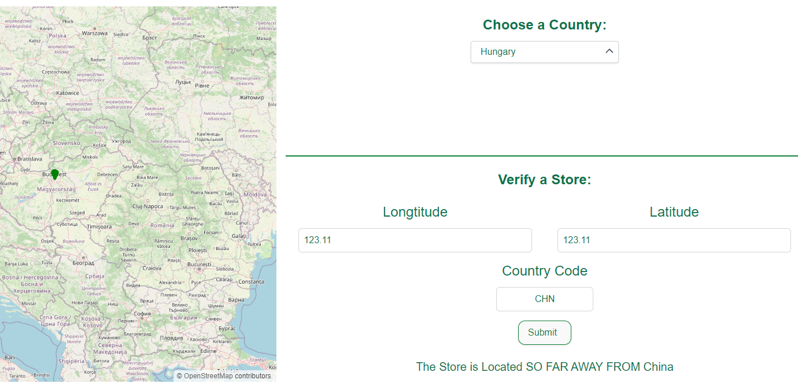

# Starbucks OL Store Locator

## Overview

Starbucks OL Store Locator is a web application that allows users to view stores on a map using the OpenLayers (OL) library. The application features a front-end built with React and Vite, and a back-end served by NGINX, which acts as a reverse proxy to both the main server and an additional service. The entire setup is containerized using Docker.

## Features

- **Map Visualization**: Utilizes OpenLayers to display a map with markers for stores. Green markers indicate store locations.
- **Country Selection**: A dropdown menu allows users to select a country, filtering the visible stores to those within the selected country.
- **Store Verification Service**: A backend service verifies if a store is located within specified coordinates and matches a country alpha-3 code.
- **Responsive Design**: Optimized for both desktop and mobile devices.

## Architecture

- **Frontend**: 
  - **React & Vite**: Fast and modern development environment.
  - **OpenLayers (OL)**: For map rendering and interactive geographical features.
  
- **Backend**:
  - **NGINX**: Serves as a reverse proxy, handling requests and routing them to the appropriate server or service.
  - **Main Server**: Handles the primary logic and data serving for the frontend.
  - **Verification Service**: A dedicated service for verifying store locations against coordinates and country codes.

- **Deployment**:
  - **Docker**: The entire application, including NGINX, the main server, and the verification service, is containerized for easy deployment and management.

## Getting Started

### Prerequisites

- Docker & Docker Compose
- Node.js (for local development)
- npm or yarn (for package management)

### Installation

1. **Clone the repository**:
   ```sh
   git clone https://github.com/synchoz/ol-store-locator.git
   cd ol-store-locator
2. **Build and run the Docker containers:**:
   ```sh
   docker-compose up --build
3. **Access the application:**:
   Open your web browser and navigate to http://localhost (or your Docker-hosted URL)

### Local Development
1. **Install dependencies:**:
   ```sh
    cd frontend
    npm install
    cd ../backend
    npm install
2. **Run the frontend:**:
   ```sh
    cd frontend
    npm run dev
3. **Run the backend:**:
   ```sh
    cd backend
    npm start
4. **Access the frontend:**:
    Navigate to http://localhost



